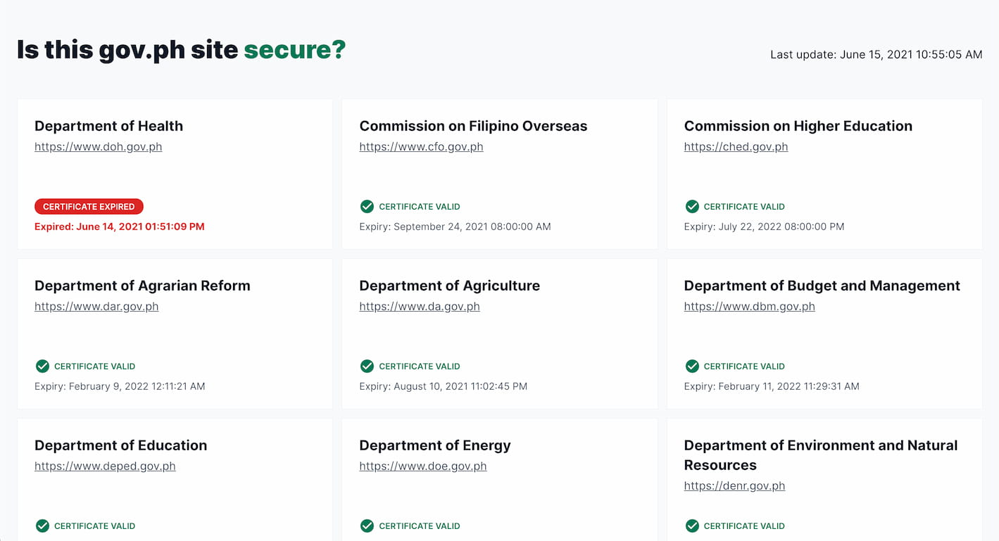

# Is this gov.ph site secure?

Show which `gov.ph` sites are secure and when their SSL certificates expire



## Contributing

Thanks for your interest to contribute to this project! To get started, fork and clone this repository then run the following commands:

```bash
cd isthisgovphsitesecure.com

# Install dependencies
npm ci

# Run development server, http://localhost:3000
npm run dev

# Build for production
npm run build

# Fetch latest data
node scripts/update-data.js
```

The sites are available in [`src/data/sites.json`](src/data/sites.json). If you want to add a new site, add the following JSON at the end of the array:

```json
{
  "title": "<the name of the website>",
  "host": "<the host of the website>"
}
```

Then run the `scripts/update-data.js` script to fetch its certificate information and populate the `status` and `expiry` fields.

## License

[MIT License](./LICENSE)
